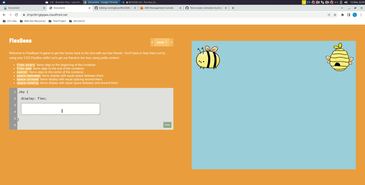

# Flex Bees

A React application built with TypeScript and vanilla CSS for programmers to practice their flexbox skillz.

## Why Build This?

The Dear Junior Dev Discord community challenge for this weekend was to build an app that teaches flexbox. We modeled the app off of the popular resource "Flexbox Froggy".

## Techonologies Used

- React
- TypeScript
- Webpack
- HTML5
- CSS3
- AWS S3 & CloudFront


## Live Deployment

Check out the site --> https://d1qic9h1gkyqwx.cloudfront.net/

## Project Summary

This was an awesome side-project to work on over the weekend!

Brandon and I had a brief meeting on Friday evening to  plan our project and setup the repo, and
then spent most of the afternoon and evening on Sunday coding up the project. One of the biggest challenges
was setting up the repository and using TypeScript, since both Brandon and I don't have a lot of experience there.
We're both really proud of the bee art (big thanks to Brandon's partner), all of the suave CSS, and the overall file structure
in the project.

Currently, the project only has a few levels, but we're looking forward to adding more levels in the future. Enjoy Flex Bees!

## Preview

### Level One!


## Development

### System Requirements
- Node.js
- npm

### Getting Started
1. Clone the repository.
```
git clone https://github.com/cam-peck/flex-bee.git
cd flex-bee
```

2. Install all dependencies with NPM.
```
npm install
```

3. To start the project...
```
npm run dev
```

4. To build the project...
```
npm run build
```

5. To upload to AWS after creating an s3 bucket...
```
aws s3 sync ./dist/ s3://flex-bee-website
```
